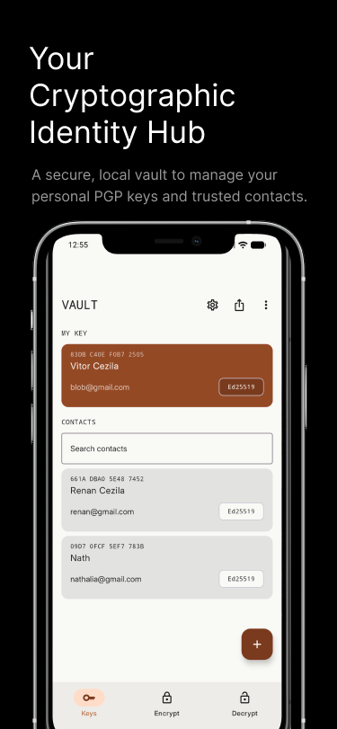
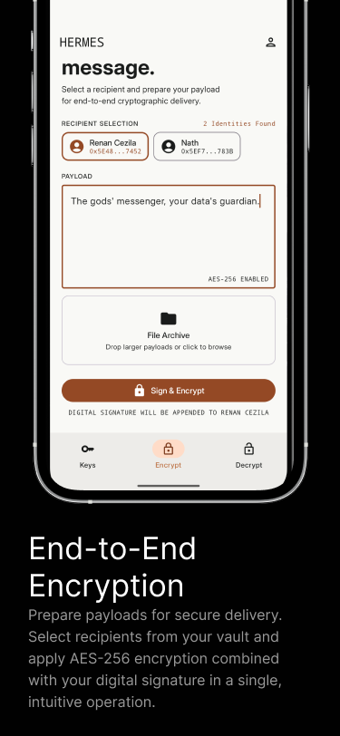
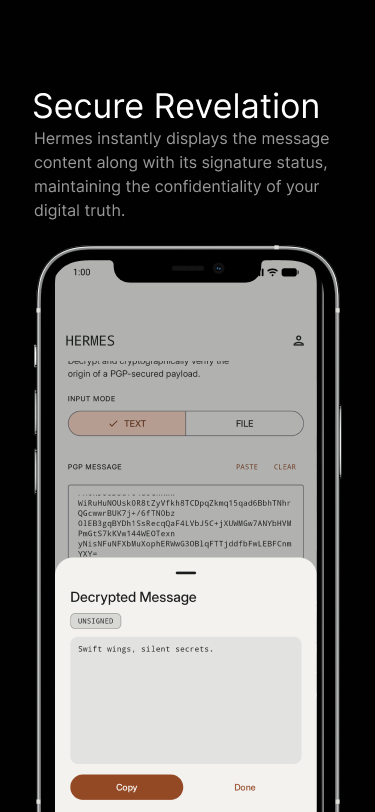
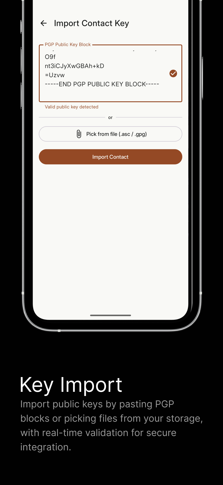

# Hermes

> The quiet space for your digital truth.

[](https://github.com/VitorCezila/hermes-android/actions/workflows/ci-lint.yml)
[](https://github.com/VitorCezila/hermes-android/actions/workflows/ci-unit-tests.yml)

A local PGP key manager for Android. Manage your cryptographic identities, encrypt messages, and verify signatures — entirely on your device, with no accounts, no cloud, and no backend.

<p align="center">
  
</p>

---

## Screenshots

<p align="center">
  
  
  
  
</p>

---

## About

Hermes brings the power of PGP key management to Android, inspired by desktop tools like Kleopatra. It is built around a single principle: **your private keys never leave your device.**

There are no accounts to create, no servers to trust, and no data sent anywhere. Every cryptographic operation — key generation, encryption, signing, decryption, verification — happens locally using the Android Keystore and on-device storage.

The interface is designed to feel calm and deliberate, treating cryptographic data with the care it deserves rather than wrapping it in "security theater" aesthetics.

---

## Features

### Key Management
- Generate PGP key pairs (RSA-4096 and Ed25519)
- Import existing keys from `.asc` or `.gpg` files
- Export your public key via file or share sheet
- View key fingerprints and metadata
- Manage key trust and revocation

### Encryption & Signing
- Select one or more recipients from your key vault
- Encrypt messages and files to a recipient's public key
- Sign a payload with your private key
- Combined sign-and-encrypt in a single operation

### Decryption & Verification
- Decrypt received messages and files with your private key
- Verify signatures against imported public keys
- Inspect session details (protocol, cipher, hash)

---

## Supported Algorithms

| Algorithm | Type | Key Size | Notes |
|-----------|------|----------|-------|
| RSA-4096 | RSA | 4096 bits | Widely compatible with existing PGP implementations |
| Ed25519 | EdDSA | 256 bits | Modern, fast, compact. Recommended for new key pairs |

Ed25519 is the recommended choice for new keys unless interoperability with legacy systems requires RSA.

---

## Tech Stack

- **Language:** Kotlin
- **UI:** Jetpack Compose + Material 3
- **Architecture:** MVI (Model-View-Intent) with Clean Architecture
- **Key Storage:** Android Keystore
- **PGP:** Bouncy Castle *(planned)*
- **Min SDK:** 24 (Android 7.0 Nougat)
- **Target SDK:** 36
- **Build System:** Gradle with Kotlin DSL

---

## Architecture

Hermes follows Clean Architecture with three distinct layers:

```
Presentation  ──►  Domain  ──►  Data
```

**Presentation Layer**
Jetpack Compose screens driven by ViewModels following the MVI pattern. Each screen has a `State`, a set of `Intent`s dispatched by user interactions, and `SideEffect`s for one-time events like navigation or toasts.

**Domain Layer**
Pure Kotlin. Contains use cases (e.g., `GenerateKeyPairUseCase`, `EncryptMessageUseCase`) and repository interfaces. No Android dependencies. This is the heart of the business logic.

**Data Layer**
Repository implementations, Android Keystore integration, and the Bouncy Castle PGP wrapper. Handles all persistence and cryptographic execution. Mappers translate between data models and domain entities.

**Data flow:**
```
UI Event → Intent → ViewModel → Use Case → Repository → Data Source
                                                              │
State ◄── ViewModel ◄── Use Case ◄────────────────────────────
```

---

## Project Structure

```
com.cezila.hermes/
├── domain/
│   ├── model/              # PgpKey, KeyPair, Fingerprint, ...
│   ├── repository/         # Repository interfaces
│   └── usecase/            # GenerateKeyPair, EncryptMessage, ...
├── data/
│   ├── repository/         # Repository implementations
│   ├── keystore/           # Android Keystore integration
│   ├── pgp/                # Bouncy Castle PGP wrapper
│   └── mapper/             # Data ↔ Domain mappers
├── presentation/
│   ├── keylist/            # Key vault screen
│   ├── keydetail/          # Key detail screen
│   ├── generatekey/        # Key generation screen
│   ├── importkey/          # Key import screen
│   ├── encrypt/            # Encrypt & sign screen
│   ├── decrypt/            # Decrypt & verify screen
│   └── components/         # Shared Compose components
└── ui/
    └── theme/              # Material 3 theme (Color, Type, Theme)
```

> This is the planned structure. Packages are created as features are implemented.

---

## Design System

Hermes uses a custom design language called **The Tactile Digital Archive** — a humanistic, editorial aesthetic that rejects the cold "high-tech" look common in cryptographic software.

Key properties:
- **Palette:** Paper `#F9F9F6` · Charcoal `#1A1C1B` · Clay `#944925`
- **Typography:** Inter for UI text, Monospace for cryptographic data (hashes, fingerprints)
- **Depth:** Achieved through tonal layering, not drop shadows
- **Motion:** Intentional, minimal — no decorative animations

---

## Building and Running

### Prerequisites
- Android Studio (latest stable)
- JDK 11 or higher
- Android SDK with API 36

### Steps
1. Clone the repository
   ```bash
   git clone https://github.com/VitorCezila/hermes-android.git
   cd hermes-android
   ```
2. Open the project in Android Studio
3. Let Gradle sync finish
4. Run on an emulator or physical device (API 24+)

### Command-line build
```bash
./gradlew assembleDebug
```
Output: `app/build/outputs/apk/debug/app-debug.apk`
